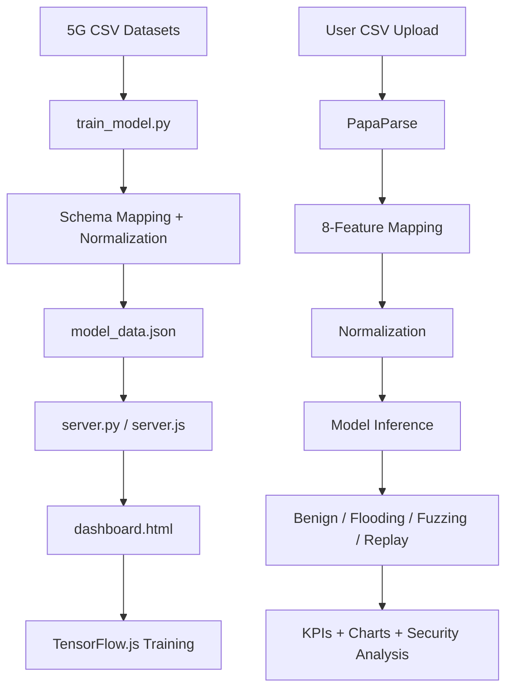

# System Architecture — 5G IDS

## High-level components

- **Dataset layer:** Local benign and attack CSV datasets used for training and testing.
- **Offline preprocessing:** `train_model.py` loads the CSV files, maps different schemas into a common eight-feature representation, normalizes the values, creates train/test data, and exports `model_data.json`.
- **Local server:** `server.py` (recommended) or `server.js` serves the dashboard and local assets.
- **Frontend dashboard:** `dashboard.html` provides CSV upload, model status, security statistics, classification results, and charts.
- **Browser ML:** TensorFlow.js trains and performs inference in the browser.

## ML architecture

- **Input:** 8 standardized traffic features
- **Classes:** Benign, Flooding, Fuzzing, Replay
- **Network:** Dense(64) → Dropout → Dense(32) → Dropout → Dense(16) → Dense(4, Softmax)
- **Fast mode:** Uses a balanced subset for practical browser-based demonstration and quick evaluation.

## Data flow

