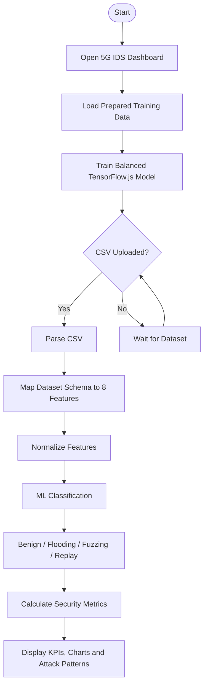

# 5G IDS Workflow

## Output Interpretation

- **Legitimate traffic:** predicted as Benign
- **Malicious traffic:** predicted as Flooding, Fuzzing, or Replay
- **Dashboard output:** traffic totals, detected attack categories, security information, and visual analytics
