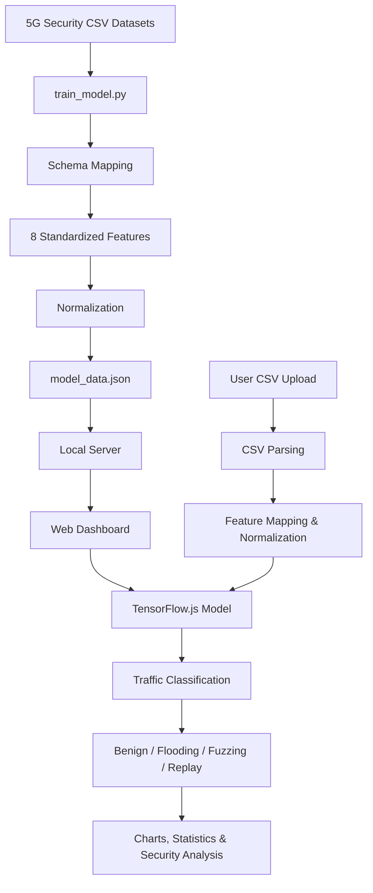

# 5G IDS — Capstone 1

**5G IDS** is a machine-learning-based Intrusion Detection System developed for **Capstone 1** to detect, classify, and visualize malicious traffic in 5G networks.

The project combines heterogeneous 5G security datasets, standardized feature extraction, neural-network classification, CSV-based traffic analysis, and an interactive web dashboard.

## Project Objective

The system is designed to:

- study major security vulnerabilities associated with 5G networks;
- analyze labelled benign and malicious 5G traffic;
- convert different CSV schemas into a common feature representation;
- classify traffic into **Benign, Flooding, Fuzzing, and Replay** categories;
- provide a web dashboard for dataset upload and security analysis;
- visualize attack distributions, risk levels, and network-security information.

## Key Features

- CSV dataset upload and analysis
- ML-based 5G traffic classification
- Four-class classification: **Benign / Flooding / Fuzzing / Replay**
- Support for canonical 5G and flow-based CSV structures
- Common 8-feature representation
- Feature normalization for consistent training and inference
- Interactive security dashboard
- Attack distribution and risk visualizations
- Quick model accuracy display
- Local Python or Node.js server support

## Machine Learning Pipeline

The project standardizes traffic using eight features:

1. `RequestMessages`
2. `SuccessfulResponseMessages`
3. `RequestResponseRatio`
4. `RegistrationRate`
5. `PDURequestRate`
6. `RequestIAT`
7. `ProcedureCodeNumber`
8. `ProcedureCodeRate`

Flow-based datasets are mapped to an equivalent eight-feature vector so that different dataset structures can be processed by one classification pipeline.

Features are normalized using max scaling:

```text
x_normalized = x / x_max
```

The combined dataset is split into approximately **80% training data and 20% testing data**.

## Neural Network Architecture

The browser-based TensorFlow.js classifier uses:

```text
8 Input Features
      ↓
Dense (64)
      ↓
Dropout
      ↓
Dense (32)
      ↓
Dropout
      ↓
Dense (16)
      ↓
Dense (4, Softmax)
      ↓
Benign | Flooding | Fuzzing | Replay
```

A balanced fast-training mode is used for practical demonstrations and helps reduce class-bias during quick browser training.

## System Architecture



## Technology Stack

| Component | Technology |
|---|---|
| Dashboard | HTML5, CSS3, JavaScript |
| Machine Learning | TensorFlow.js |
| Data Processing | Python |
| CSV Parsing | PapaParse |
| Visualization | Chart.js |
| Local Server | Python / Node.js |
| Dataset Format | CSV |

## Project Structure

```text
5G-IDS-Capstone1/
├── dashboard.html
├── train_model.py
├── analyze_csv.py
├── server.py
├── server.js
├── model_data.json
├── *.csv
├── ARCHITECTURE.md
├── METHODOLOGY.md
├── DATASET_INFO.md
├── FLOWCHART.md
├── PRESENTATION_GUIDE.md
├── start_server.sh
├── start_server.ps1
├── start_server.bat
└── README.md
```

## Running the Project

### Python

```bash
python server.py
```

Then open the local dashboard address shown by the server, normally:

```text
http://127.0.0.1:8000
```

### Node.js

```bash
node server.js
```

### Linux/macOS helper

```bash
chmod +x start_server.sh
./start_server.sh
```

## Workflow

1. Collect labelled 5G network traffic datasets.
2. Map different dataset schemas into the standardized eight-feature representation.
3. Normalize the extracted features.
4. Prepare training and testing data.
5. Train the four-class neural-network classifier.
6. Upload a CSV file through the dashboard.
7. Map and normalize uploaded traffic using the same pipeline.
8. Predict the traffic class.
9. Display benign/malicious totals, attack categories, charts, and security information.

## Attack Categories

The project analyzes several forms of 5G security traffic, including:

- **Flooding attacks** — including deregistration, registration, ICMP, SYN, and PDU-related flooding patterns.
- **Replay attacks** — repeated/high-rate control-plane traffic patterns.
- **Fuzzing attacks** — malformed or abnormal signalling/message patterns.
- **Benign traffic** — legitimate network activity used as the normal class.

## Dataset

The project uses 5G security datasets derived from the **5GDatasets** research dataset collection. The included dataset documentation describes the supported attack scenarios and schema-handling approach.

## Academic Scope

This repository is an academic **Capstone 1** project intended to demonstrate the design and implementation of a machine-learning-based intrusion detection workflow for 5G network traffic. Results should be interpreted within the datasets, preprocessing methods, and evaluation setup used by the project.

## Project

**Capstone 1 — 5G Intrusion Detection System (5G IDS)**

Cybersecurity · 5G Network Security · Intrusion Detection · Machine Learning · Traffic Classification · Security Visualization
